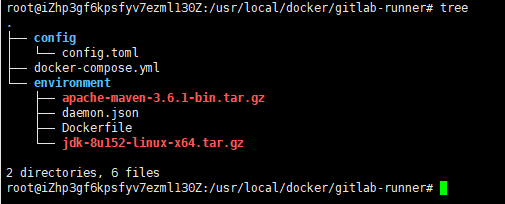
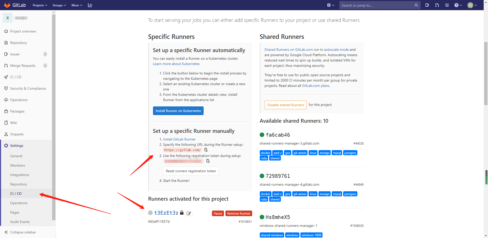

### gitlab-ci和gitlab-runner使用学习
> 自己开发个系统,买了个阿里云服务器，每次修改点东西还得打包上传比较麻烦，研究了一下通过gitlab实现持续
集成  
> 此项目(demo)是一个springcloud项目,java8环境  
> 软件的安装必须要先有docker和docker-compose环境
### 安装gitlab
可以不用安装,直接使用官网(gitlab.com)提供的仓库  
1.创建docker-compose.yml安装gitlab
```yaml
version: '3'
services:
    web:
      image: 'twang2218/gitlab-ce-zh' # 中文版gitlab,hub.docker.com中获取版本
      restart: always
      hostname: '192.168.174.20'
      environment:
        TZ: 'Asia/Shanghai'
        GITLAB_OMNIBUS_CONFIG: |
          external_url 'http://192.168.174.20'
          gitlab_rails['time_zone'] = 'Asia/Shanghai'
      ports:
        - '8443:443'
        - '2222:22'
        - '80:80'
      volumes:
        - /usr/local/docker/gitlab/config:/etc/gitlab
        - /usr/local/docker/gitlab/data:/var/opt/gitlab
        - /usr/local/docker/gitlab/logs:/var/log/gitlab

```
2.执行
```shell script
docker-compose up -d
```
### 安装gitlab-runner
需要安装gitlab-runner并执行Dockerfile文件构建编译环境
1. 创建Dockerfile文件用于安装项目编译环境
```dockerfile
FROM gitlab/gitlab-runner:v11.0.2
MAINTAINER sunafei <924393541@qq.com>

# 修改软件源
RUN echo 'deb http://mirrors.aliyun.com/ubuntu/ xenial main restricted universe multiverse' > /etc/apt/sources.list && \
    echo 'deb http://mirrors.aliyun.com/ubuntu/ xenial-security main restricted universe multiverse' >> /etc/apt/sources.list && \
    echo 'deb http://mirrors.aliyun.com/ubuntu/ xenial-updates main restricted universe multiverse' >> /etc/apt/sources.list && \
    echo 'deb http://mirrors.aliyun.com/ubuntu/ xenial-backports main restricted universe multiverse' >> /etc/apt/sources.list && \
    apt-get update -y && \
    apt-get clean

# 安装 Docker
RUN apt-get -y install apt-transport-https ca-certificates curl software-properties-common && \
    curl -fsSL http://mirrors.aliyun.com/docker-ce/linux/ubuntu/gpg | apt-key add - && \
    add-apt-repository "deb [arch=amd64] http://mirrors.aliyun.com/docker-ce/linux/ubuntu $(lsb_release -cs) stable" && \
    apt-get update -y && \
    apt-get install -y docker-ce
# 修改为阿里云镜像加速
COPY daemon.json /etc/docker/daemon.json

# 安装 Docker Compose 通过DaoCloud安装
WORKDIR /usr/local/bin
RUN curl -L https://get.daocloud.io/docker/compose/releases/download/1.25.0-rc2/docker-compose-`uname -s`-`uname -m` > /usr/local/bin/docker-compose
RUN chmod +x docker-compose

# 安装 Java
RUN mkdir -p /usr/local/java
WORKDIR /usr/local/java
COPY jdk-8u152-linux-x64.tar.gz /usr/local/java
RUN tar -zxvf jdk-8u152-linux-x64.tar.gz && \
    rm -fr jdk-8u152-linux-x64.tar.gz

# 安装 Maven
RUN mkdir -p /usr/local/maven
WORKDIR /usr/local/maven
COPY apache-maven-3.6.1-bin.tar.gz /usr/local/maven
RUN tar -zxvf apache-maven-3.6.1-bin.tar.gz && \
    rm -fr apache-maven-3.6.1-bin.tar.gz
# maven中已经包含最新的settings
# COPY settings.xml /usr/local/maven/apache-maven-3.6.1/conf/settings.xml

# 配置环境变量
ENV JAVA_HOME /usr/local/java/jdk1.8.0_152
ENV MAVEN_HOME /usr/local/maven/apache-maven-3.6.1
ENV PATH $PATH:$JAVA_HOME/bin:$MAVEN_HOME/bin

WORKDIR /
```
2.创建docker-compose.yml安装gitlab-runner
```yaml
version: '3.1'
services:
  gitlab-runner:
    build: environment
    restart: always
    container_name: gitlab-runner
    privileged: true
    volumes:
      - /usr/local/docker/runner/config:/etc/gitlab-runner
      - /var/run/docker.sock:/var/run/docker.sock
```
所需文件和文件结构如下:  
  
其中config目录是安装完成的挂载卷配置文件
environment下为编译环境所需文件,需要自己准备,即下载项目后编译、打包、运行环境,其中daemon.json为docker阿里镜像加速配置  
3.执行安装
```shell script
docker-compose up -d
```
### 项目上创建gitlabel钩子文件(.gitlab-ci.yml)执行流水线
```yaml
stages:
  - build
  - run
  - clean
build:
  stage: build
  script:
    - /usr/local/maven/apache-maven-3.6.1/bin/mvn package
    - cp target/stu-gitlab-runner-0.0.1-SNAPSHOT.jar docker
    - cd docker
    - docker build -t sunafei/gitlab-runner .
run:
  stage: run
  script:
    - cd docker
    - docker-compose down
    - docker-compose up -d
clean:
  stage: clean
  script:
    - docker rmi $(docker images -q -f dangling=true)
```
### 构建docker容器并运行编译后jar包(项目根目录docker文件夹下)
1. Dockerfile
```dockerfile
FROM openjdk:8-jre

RUN mkdir /app
COPY stu-gitlab-runner-0.0.1-SNAPSHOT.jar /app/app.jar

ENTRYPOINT ["java", "-Djava.security.egd=file:/dev/./urandom", "-jar", "/app/app.jar", "--spring.profiles.active=prod"]

EXPOSE 8088
```
2.docker-compose.yml
```yaml
version: '3.1'
services:
  stu-gitlab-runner:
    restart: always
    image: sunafei/gitlab-runner
    container_name: stu-gitlab-runner
    ports:
      - 8088:8088
```
### 向gitlab-runner中注册gitlab项目
```shell script
docker exec -it gitlab-runner gitlab-runner register

# 输入 GitLab 地址
Please enter the gitlab-ci coordinator URL (e.g. https://gitlab.com/):
http://xxxxxx:8080/

# 输入 GitLab Token
Please enter the gitlab-ci token for this runner:
xxxxxxxxxx

# 输入 Runner 的说明
Please enter the gitlab-ci description for this runner:
可以为空

# 选择 runner 执行器，这里我们选择的是 shell
Please enter the executor: virtualbox, docker+machine, parallels, shell, ssh, docker-ssh+machine, kubernetes, docker, docker-ssh:
shell
```
其中地址和token从如下位置获取,注册成功后下方会显示注册信息
### 提交代码 自动运行构建

### 参考
千锋教育李卫民《Java 微服务架构合集》系列[视频](https://www.bilibili.com/video/av29384041)